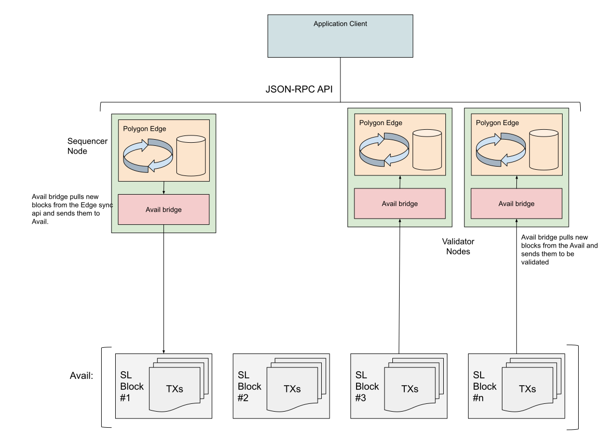

# Polygon Avail Settlement

## Description

Avail Settlement Layer provides an EVM compatible blockchain for rollups to
store their data and perform dispute resolution. Avail Settlement Layer itself
utilizes [Polygon Avail](https://polygon.technology/solutions/polygon-avail/)
for Data Availability and when rollups are using Settlement Layer, they also
inherit all the Data Availability properties of Polygon Avail.

The Settlement Layer is built with [Polygon Edge](https://polygon.technology/solutions/polygon-edge/).

## Usage

TBD.

## Architecture

