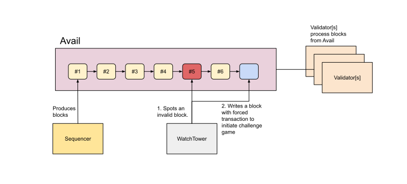
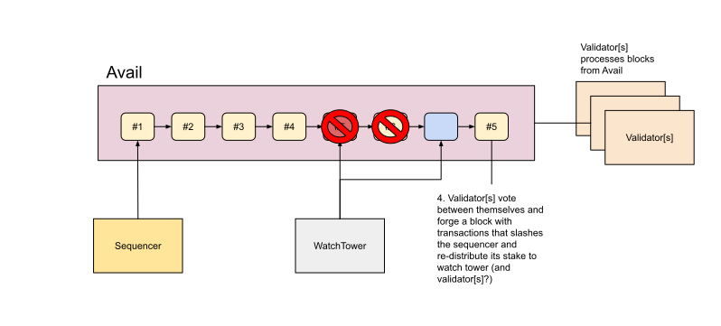

# Avail Settlement Layer Design

## Introduction

This document presents design of the Avail Settlement Layer. It is an
optimistic rollup implemention on top of Avail to provide dispute resolution
for application rollups that are built on top of Avail platform.

## High Level Architecture

### Sequencer Nodes

Sequencer node's main function is to aggregate & execute incoming transactions,
extract the resulting state transitions and then store these in a block that is
pushed to Avail.

Corresponding sequencer node is also responsible to defend itself, in case a
watch tower node finds out any mismatches from a block.

In the first phase, there is a single sequencer node.

### Validator Nodes

Validator nodes follow Avail and read new blocks in order. They optimistically
assume that the blocks are valid (given some sanity checks) and directly apply
the state transitions into their state database[s].

In the event of fault proof, the validator nodes will execute the transactions
from a special block[s], that will result in correction of the chain state.

After the set quarantee time, the block gets finalized and becomes available to
clients.

### Watch Tower Nodes

Watch Tower Nodes follow the generated blocks from Avail, similar to validator
nodes, but instead of optimistically trusting that the state transitions are
valid, the watch tower nodes execute the transactions contained in the block
and compare the resulting state transitions with those present in the block.

If there are any differences between the generated state transitions and those
stored in the block, the corresponding watch tower node challenges the
corresponding sequencer and generates a fault proof.

### P2P Network

All nodes are connected via P2P network, to quickly receive & spread the
information about latest blocks and potential fraud proofs. More detailed
networking specification shall be documented later.

## Block Ordering

### Ordering from Avail

The block ordering comes strictly from Avail. The order of the blocks is the
order they appear in Avail.

## Incentive structure

On every block that the sequencer generates, there must be a stake that gets
locked until the block gets finalized. In the event of submission of invalid
block, followed by successful fraud proofe generation, the corresponding
sequencer looses the stake.

TODO: Draw a sequence diagram.

## Block

### Structure

TODO: Define a block structure.

### Fraud Proof Block

Fraud Proof Block is a special block, instructing validators to fully
verify and re-execute transactions in it. It contains the notion of the
performed challenge game between watch tower node and corresponding sequencer
node.

TODO: Define detailed block structure.

### Finality

Block finality is determined by a relative time of *n* blocks. If there is no
fraud proof generated by then, the block is considered final.

## Fraud Proof

When the watch tower node finds out mismatches in generated state transitions,
it starts challenge game by writing a special block into Avail.

### Challenge Process

Challenge process starts when a watch tower spots an invalid block and it writes a corresponding special block straight into Avail.

This special block contains a forced transaction, in which the watch tower deposits a stake and commences the challenge game.

All validators must stop accepting further blocks until initiated challenge game has completed.

The validators now rewind their local blockchains back to point before the block under dispute. They re-execute all the transactions from the blocks and compare results with the claims from the sequencer.

Once validators have come up with results, whether the disputed block is valid or not, they must vote amongst themselves, whether they agree on the result or not. They must also coordinate, which one writes the result into Avail.

In case the disputed block is deemed invalid, the sequncer will be slashed and watch tower rewarded. The invalid block gets dismissed from the blockchain, and replaced with a new one.

In case the disputed block comes out as valid, the watch tower loses its stake and sequencer gets rewarded.

In case the challenge game is waiting for input from some participant and the participant fails to communicate within defined time limit, the challenge game is completed early and the silent party loses its stake. Once the challenge game has been completed, the blockchain continues advancing as before.

## Ethereum compatibility

While the Settlement Layer chain does not attempt to replicate an Ethereum
chain on top of Avail, it tries to be EVM compatible, including most of the
related tooling to the extend it's feasible. This lowers the barrier of entry
for existing Ethereum developers and allows leveraging existing tooling instead
of requiring re-implementing the wheel.
