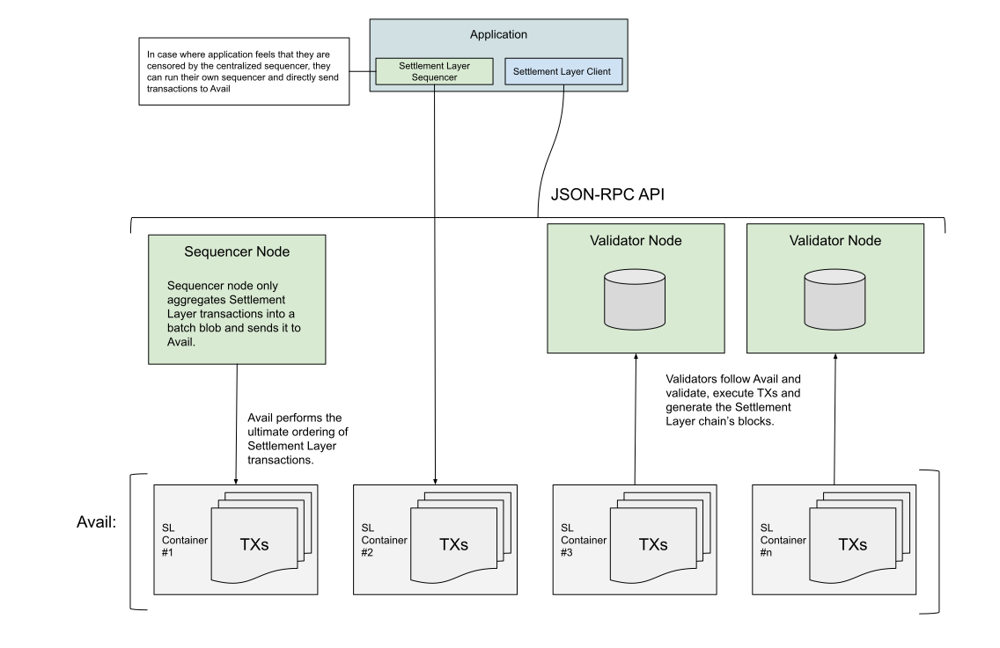

# Avail Settlement Layer Design

## Introduction

This document presents design of the Avail Settlement Layer. It is an
optimistic rollup implemention on top of Avail to provide dispute resolution
for application rollups that are built on top of Avail platform.

## High Level Architecture

### Sequencer Nodes

So called sequencer nodes' main function is to aggregate transactions and batch
them into Avail. They are called "sequencer nodes" with quotes, because
ultimately the ordering of transactions is done by Avail and not sequencers.

In the first version of Settlement Layer, ideally there is only one centralized
sequencer, but since the ultimate ordering of transactions is done by Avail, it
is possible to bypass the central sequencer and run multiple ones concurrently.
However, the sequencers don't communicate together and therefore, combined with
later described incentives, it requires careful consideration whether to run
"own sequencer" instead of relying on the central one.

Each batch of transactions forms a block in Avail.

### Validator Nodes

Validator nodes follow Avail and read, execute and validate batched
transactions in order. On valid batch of transactions, a Settlement Layer block
gets generated. In case there is an invalid batch of transactions in a block in
Avail, the corresponding sequencer that produced it, gets slashed.

After quarantee time, the block gets finalized and becomes available to
clients.

## Transaction Ordering

### Ordering from Avail

In most of the optimistic rollups, it is sequencer's responsibility to order
and batch the transactions. This makes it difficult to introduce a distributed
sequencing without introducing a full consensus implementation on L2.

Avail Settlement Layer uses Polygon Avail DA, combined with incentives, to
provide ordering of L2 transactions. This design allows multiple concurrent
sequencers, but discourages race conditions because conflicts in state
manipulations performed by competing transactions can yield slashing.

### Incentives

On every batch of transactions that sequencer generates, there must be a stake
that gets locked until the batch becomes a finalized block. On the event of
submission of invalid transaction, sequencer looses the stake.

This guides two important aspects:

1. The sequencer does its best to ensure validity of the transaction against
   known blockchain state.
2. The sequencer does its best to avoid competing transactions, where two
   different transactions, submitted by two distinct sequencers, modify the
   shared account state.

Especially the number 2. of those aspects is such that discourages running your
own sequencer "for the fun". Still, it doesn't prevent an application rollup to
doing so, if they feel that they get unfair treatment by central sequencer.

## Finality

Block finality is determined by a relative time of *n* blocks. If there is no
fraud proof generated by then, the block is considered final.

### Fraud Proof

TBD

